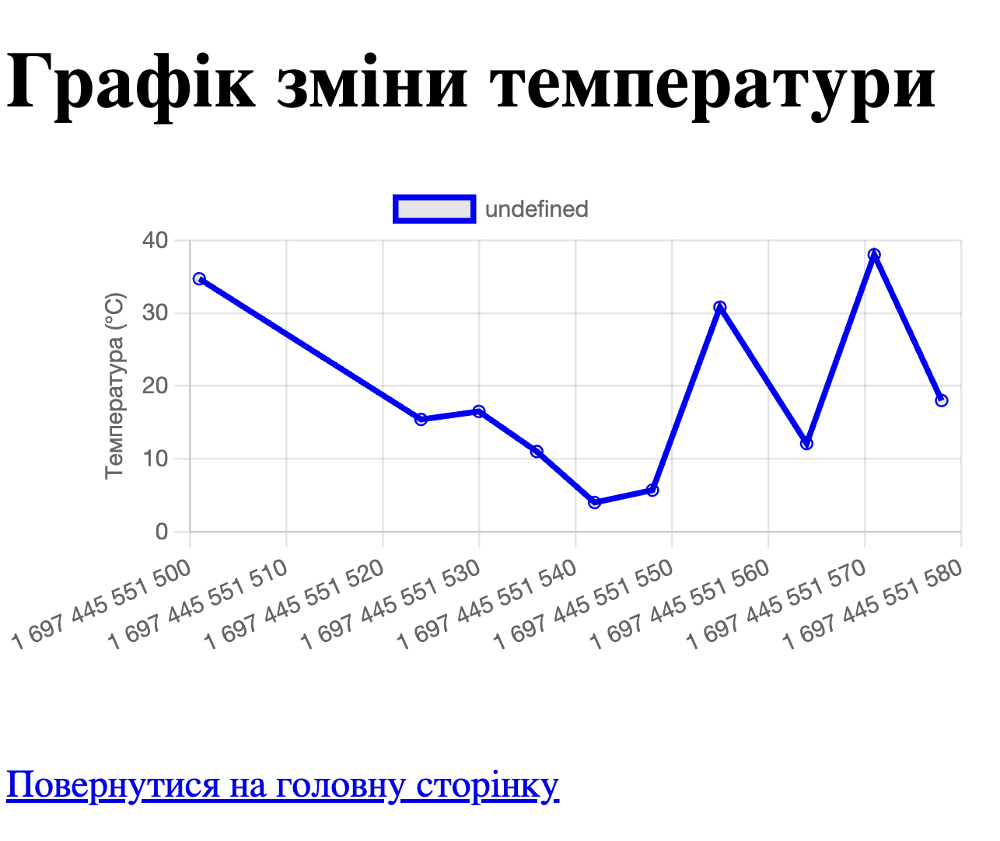

# Sensor data monitoring system
The project is designed to collect and analyze data

received from various sensors, such as temperature,

humidity and others. It helps users track changes

in metrics in real time and analyze them.
## How can I run it?
+ You can clone it using:

  You can run this project from the intellij idea just do:
+ [https://www.jetbrains.com/idea/]

  ```$ git clone https://github.com/YP0n/sensor.git```

   All components are in the src folder.

   + To fill the server with data - use the client:

     You can run this project from the intellij idea just do:
   + [https://www.jetbrains.com/idea/]

  ```$ git clone https://github.com/YP0n/RestAPISensor.git```
   + data in the client is added randomly
+ Create a PostgreSQL database named sensor_db
   + [https://www.postgresql.org/]
   + Here is the SQL script to create a 
  PostgreSQL database named sensor_db 
  and create the measurements and sensor tables 
  with the specified parameters:
   + ```Створення бази даних
     CREATE DATABASE sensor_db;
     
     CREATE TABLE measurements (
     id          serial PRIMARY KEY,
     sensor_name varchar NOT NULL,
     value       numeric(3, 1),
     raining     boolean,
     created_at  timestamp
     );

     CREATE TABLE sensor (
     id   serial PRIMARY KEY,
     name varchar
     );

     -- table owner settings
     ALTER TABLE measurements OWNER TO postgres;
     ALTER TABLE sensor OWNER TO postgres;

  + **After** creating the database and tables, you can
configure the database connection in your project
using the following options:
    + ```spring.datasource.driver-class-name=org.postgresql.Driver
      spring.datasource.url=jdbc:postgresql://localhost:5432/sensor_db
      spring.datasource.username=postgres
      spring.datasource.password=postgres
      server.port=8080
      
      spring.jpa.properties.hibernate.dialect=org.hibernate.dialect.PostgreSQLDialect
      spring.jpa.properties.hibernate.show_sql=true

  + _**Run**_ this SQL script on your PostgreSQL database to **create** the required structure. After that, you can connect your application to this database and use it to store data.


### Requirements

[Java 8 or higher](https://www.java.com/en/)

[IntelliJ IDEA](https://www.jetbrains.com/idea/)

[Maven](https://maven.apache.org/)

[Postgresql](https://www.postgresql.org/)

[SpringBoot](https://mvnrepository.com/)


#### Examples of use

- Receiving and displaying the latest measurements from sensors.
- Setting up notifications in case of certain changes in sensor indicators.
- Analysis and visualization of historical sensor data using graphs.
  

#### Contribution

We welcome contributions from other developers. You can submit pull requests to fix bugs or add new features. You can also contribute by reporting issues or your own ideas for the development of the project.


#### License

This project is distributed under the MIT license. Detailed information can be found in the LICENSE.md file.

#### Contact

If you have any questions
or suggestions, please contact me at [caravell@ukr.net](caravell@ukr.net)<br>
or via the [Issues](https://github.com/YP0n/sensor/issues) section of this repository on GitHub<br>
or [LinkedIn](https://www.linkedin.com/in/yurii-ponomarenko-89347122b/).